# Quick Diagram Tool Help

#### Add a type to the diagram
* In the source code editor window position the caret on a token that has a type ...
* Right-click for the context menu
* "Add to Quick Diagram"

#### Add a type hierarchy to the diagram
* "Add to Quick Diagram With Hierarchy" also adds the base type and all subtypes (recursively).

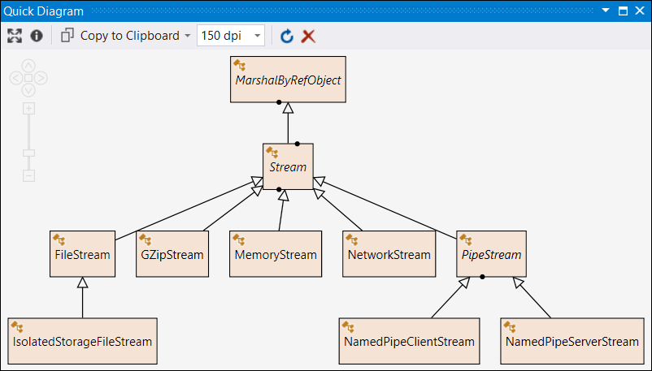

#### Show/Hide descriptions
* Use the "Show/Hide Descriptions" toolbar button to show/hide type descriptions (the summary part of the type's XML documentation).

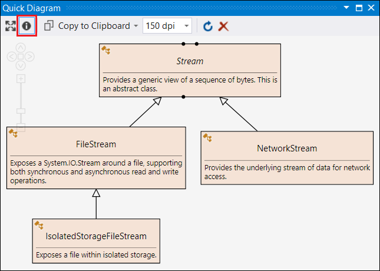

#### Extend the diagram with related entities
* Click on the pop-up mini-buttons on the diagram nodes to show related entities.

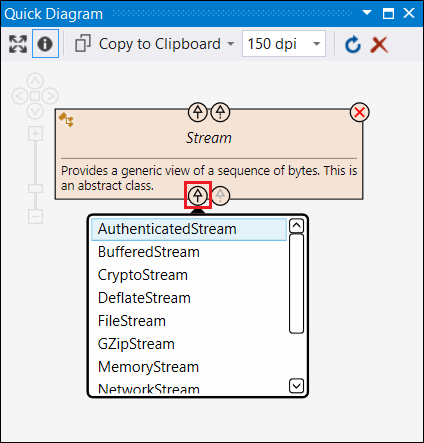

#### Type features on the diagram
* Black dots on the side of the type means that it has some related entities.
* *Italic* type name means abstract type.
* **Bold** type name means that it was found in source code.
* Normal type name means that it was found in metadata (referenced assembly).

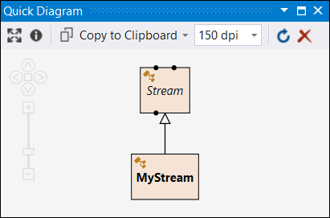

#### Navigate from the diagram to the corresponding source file
* Double-click on a diagram shape.
* It works only for those type that were found in the source code (and not in metadata).

#### Remove items from the diagram
* Click on the "remove" mini-button on a shape to remove it from the diagram.

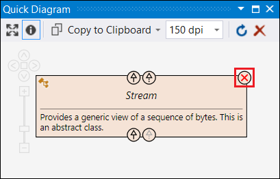

#### Export diagram to file or copy to clipboard
* Use the "Copy to Clipboard" / "Save to File..." toolbar buttons to save/copy the diagram.
* Set the desired resolution in DPI (dots per inch).

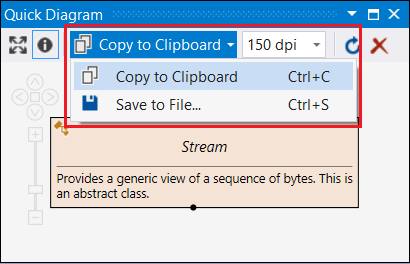

#### Clear the diagram
* Use the "Clear Diagram" toolbar button to remove all shapes from the diagram.

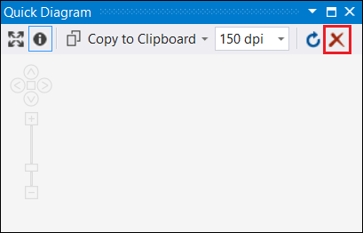

#### Update the diagram
* Use the "Update Diagram from Code" toolbar button to synchronize the diagram with the changed code.

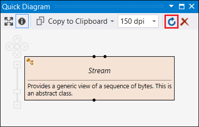

* Updates those entities/relationships that have the same fully qualified name.
* Removes those entities/relationships that no longer exist in code.
* Unfortunately this feature can't track type renames so renamed types will be removed from the diagram and must be manually added back if needed.

#### Pan and zoom on the diagram
* Use the mouse: 
  * Pan by holding down the left mouse button
  * Zoom with the mouse wheel.
* Or use the keyboard (only if the diagram window has the focus): 
  * Pan with the cursor keys.
  * Zoom with W and S keys (FPS shooter-style :)
* Or use the pan and zoom control on the diagram.

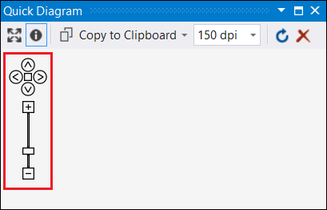

#### Zoom to the diagram
* Use the "Fit Diagram to Window" toolbar button, or the rectangle in the Pan and Zoom Control.

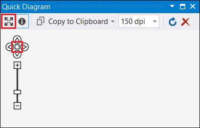

#### Open the Quick Diagram tool window
* You can open the Quick Diagram tool window from the Visual Studio menu bar:
* View > Other Windows > Quick Diagram
* Or use the keyboard shortcut: Ctrl+Shift+D, Ctrl+Shift+D

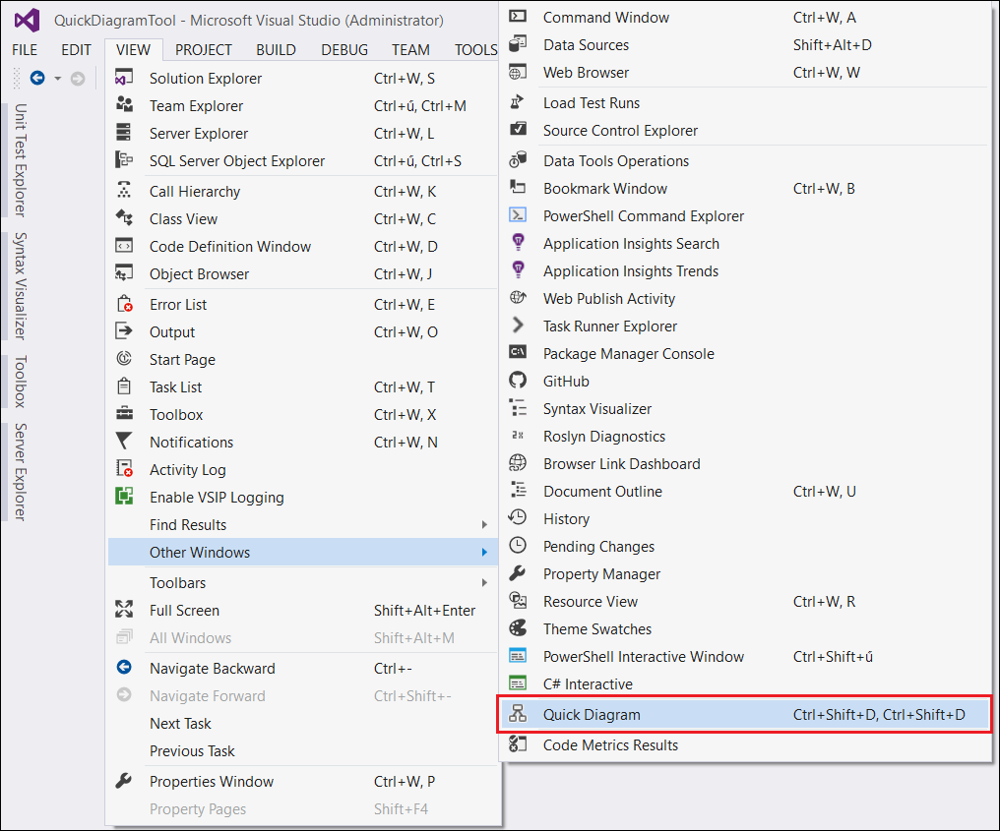